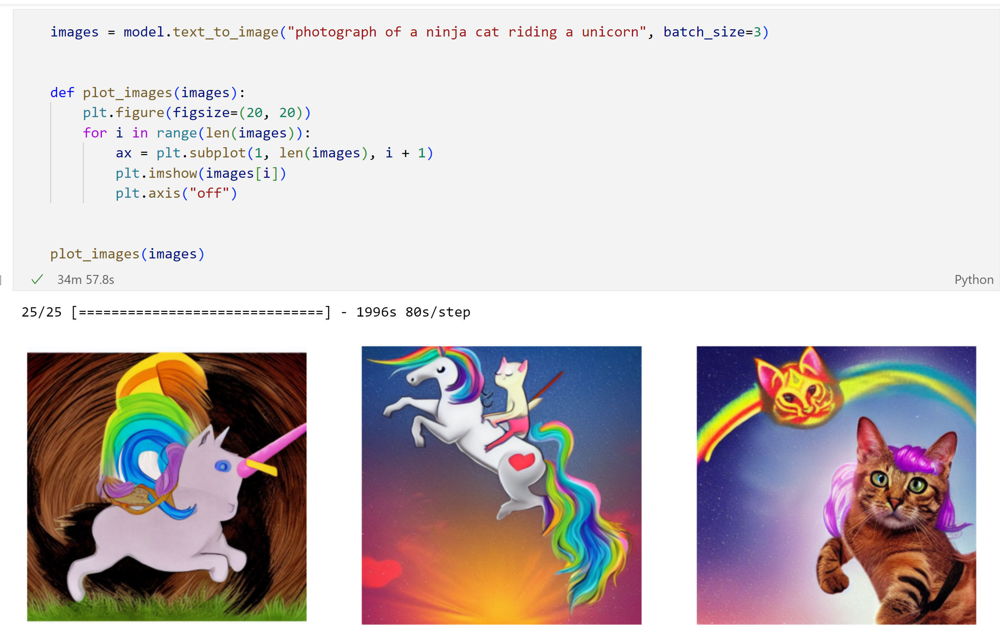

# TensorFlow study projects
I'll use this repo to store my TensorFlow (TF) study projects. I'm following here instructions from the Udemy's "TensorFlow Developer Certificate in 2022: Zero to Mastery" course.

## Project 1 - Tensor Fundamentals
1. Reviewing concepts of tensor: creation of _scalar_, _vector_ and _matrix_ tensors with **tf.constant** and **tf.Variable**;
2. Getting tensor attributes (shape, rank, index, size) and performing math (e.g., **tf.math.add**) and matrix operations;
3. Extra tensor operations: getting absolute, **min**, **max** and **mean** values. Additionally, I learn how to identify _index of max value_, remove _size-1 dimensions_ from a tensor or use _one-hot encoder_. Extra math operations include: **square**, **square root** and **logarithm**;
> **Note:** tf.config.list_physical_devices in the 3rd notebook is just to show what type of processor (CPU/GPU/TPU) we have access to.

## Project 2 - Image Generator
1. Using StableDiffusion model within **KerasCV** to generate images from the natural language descriptions (text-to-image). 

## Project 3 - Neural Network Regression
1. Start with a basic introduction to the neural networks with TF: from creating and training new model to improving its accuracy;
2. Model evaluation: importance of train / test data split and model structure visualisation. Calculating mean absolute error (**MAE**) and mean squared error (**MSE**);
3. Saving and loading trained NN model in 2 supported formats: **SavedModel** and **HDF5**;
4. Example of NN model trained on external big dataset. Also, introduces the use of one-hot-encoder with pandas' **get_dummies**, as well as normalisation and standardisation.
